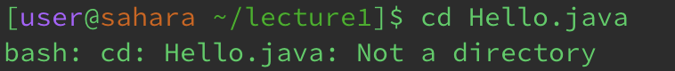
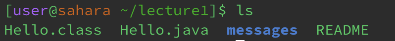
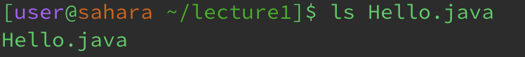
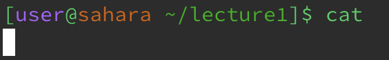
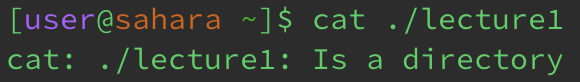
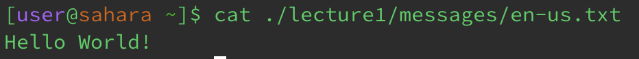

# Lab Report 1 - Remote Access and FileSystem (Week 1) {#week-1-lab-report}
# cd
 
 **Working Directory** -> `/home`
 **Reason for Output** -> The command `cd` is used to switch the current working directory to the given path. Therefore, there is no output and the working directory was not changed since no path was provided. However, if 'cd' was called inside a directory, the current working path is swithed to the home directory.
 **Error** -> No
 
  
 **Working Directory** -> `/home`
 **Reason for Output** -> The command switched the current working directory to the given path `lecture1`. Nothing was printed but the working directory was changed to `/home/lecture1`.
 **Error** -> No
 
  
 **Working Directory** -> `/home/lecture1`
 **Reason for Output** -> The command can only switch the current working directory to another directory. 
 **Error** -> Yes, since the argument was a file, there was an error becuase the command could not swith the current working directory to a file.
 
 
# ls
  
 **Working Directory** -> `/home/lecture1`
 **Reason for Output** -> The command `ls` lists the files and folders in the given path, so it listed the files and folders under `/home/lecture1`.
 **Error** -> No
 
  
 **Working Directory** -> `/home`
 **Reason for Output** -> The command `ls` can take in a path as an argument and display the files and folders in that path. So, with `/home` as the working directory and `lecture1` as the argument, the files and folders under `/home/lecture1` is displayed.
 **Error** -> No
 
  
 **Working Directory** -> `/home/lecture1`
 **Reason for Output** -> The command took in `Hello.java` as an argument with displayed the information of the files and folders within `/home/lecture1/Hello.java`, so it displayed itself.
 **Error** -> No
 
 
# cat
  
 **Working Directory** -> `/home/lecture1`
 **Reason for Output** -> The command `cat` is used to print out the contents of files. Since there is no file to print from, nothing is printed out and the terminal is stuck.
 **Error** -> No, there was no error message but the terminal is stuck.
 
  
 **Working Directory** -> `/home`
 **Reason for Output** -> A directory was given as the argument for the command, but there is an error since there is not path to a file.
 **Error** -> Yes, the command cannot print out the contents of a directory.
 
  
 **Working Directory** -> `/home`
 **Reason for Output** -> The command was given a path to the file `en-us.txt` and the command prints out the contents of the file which was `"Hello World!"`
 **Error** -> No
