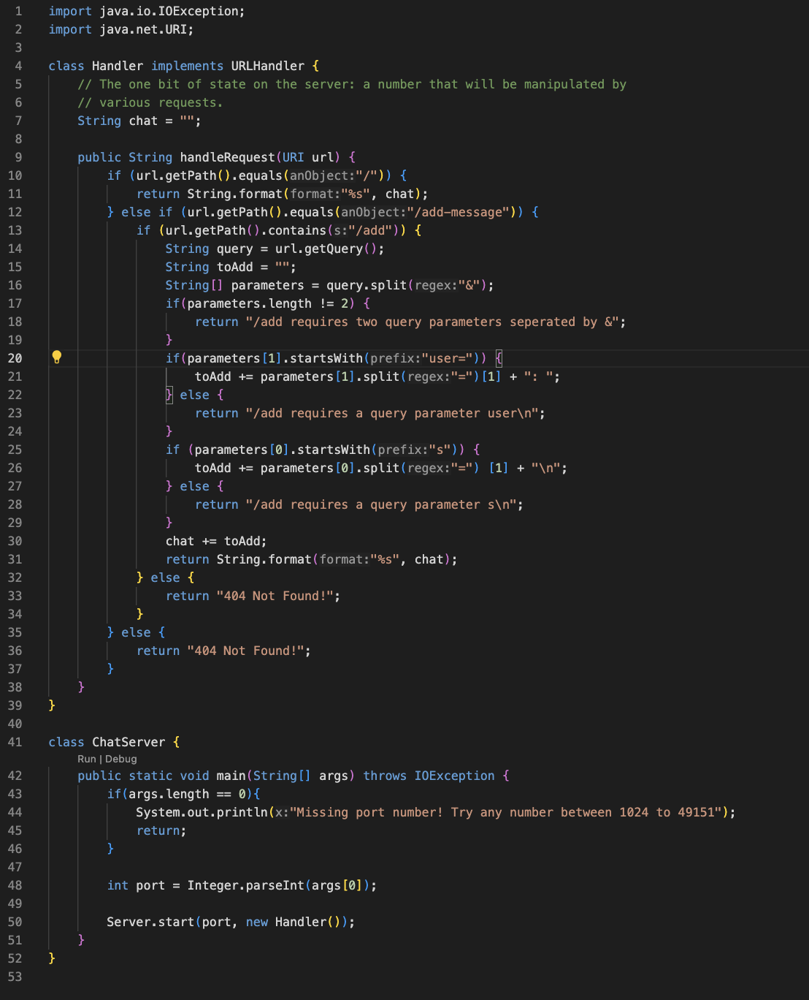
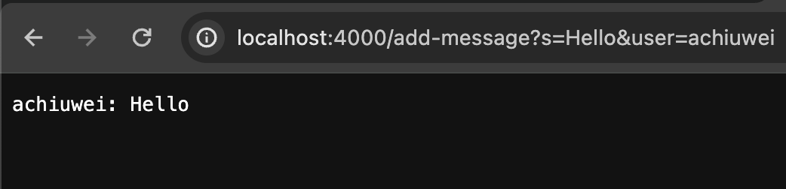
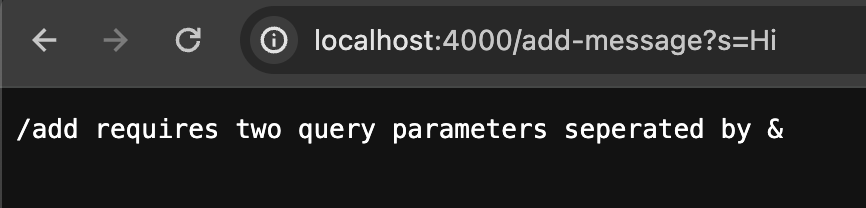
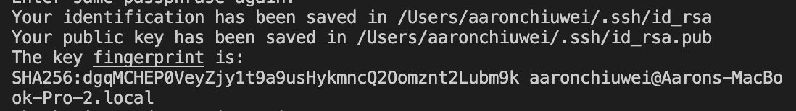
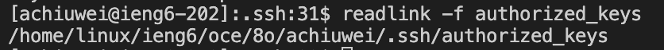
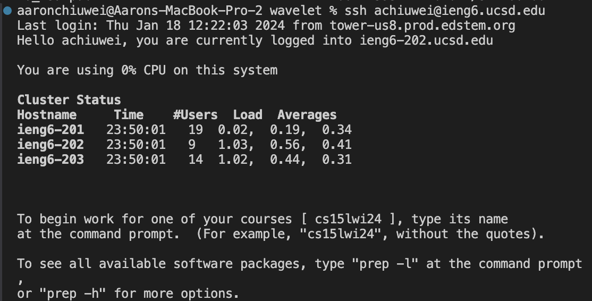

# Lab Report 2 - Servers and SSH Keys (Week 3) {#week-3-lab-report}
# Part 1 ChatServer.java
 
 
 **ScreenShot 1**
 
 **Which methods in your code are called?** -> The main method and handleRequest method are called.
 **What are the relevant arguments to those methods, and the values of any relevant fields of the class?** -> The argument to main are the command line arguments. The argument to handleRequest is the URL of the server browser.
 
 **ScreenShot 2** 
 
 
# Part 2 SSH Key
 
 
 
 
 
 
# Part 3 ChatServer.java
 From the lab in week 2, I learned how to create and run my own server. In this process, I also learned how to get arguments from a URL and change what is displayed and stored based on the URL. In addition, I also learned how to get command line arguments when I had to get the port number to run the server.
