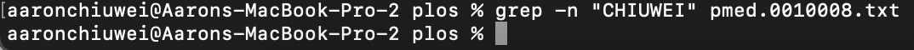
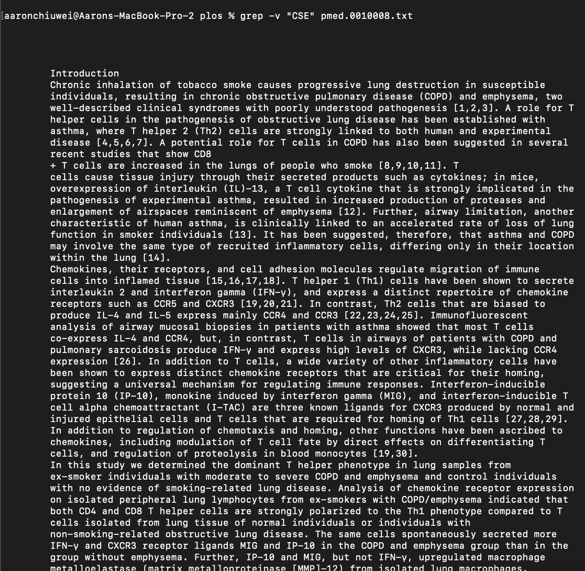

# Lab Report 3 - Bugs and Commands (Week 5)
# Part 1 - Bugs
**Failure Inducing Input**
```java
@Test
public void testFailure() {
  int[] input = {1, 2, 3};
  ArrayExamples.reverseInPlace(input);
  assertArrayEquals(new int[]{3, 2, 1}, input);
}
```
**No Failure Inducing Input**
```java
@Test
public void testNoFailure() {
  int[] input = {1};
  ArrayExamples.reverseInPlace(input);
  assertArrayEquals(new int[]{1}, input);
}
```
**Symptom**
<br> 
<br>**Before Code Change**
```java
static void reverseInPlace(int[] arr) {
  for(int i = 0; i < arr.length; i += 1) {
    arr[i] = arr[arr.length - i - 1];
  }
}
```
**After Code Change**
```java
static void reverseInPlace(int[] arr) {
  int firstElem = arr[0];
  for(int i = 0; i < arr.length - 1; i += 1) {
    arr[i] = arr[arr.length - i - 1];
  }
  arr[arr.length - 1] = firstElem;
}
```
**Describe why the fix addresses the issue**
<br>The fix for reverseInPlace method changes the loop to 
not reach the last element and set the last element to the 
original first element. This addresses the issue of the last
element being set to the wrong element because the first 
element was already changed by storing the first element
and setting the last element to the stored element.
# Part 2 - Researching Commands (`grep`)
<br> 

<br> **-c** [source](https://man7.org/linux/man-pages/man1/grep.1.html)
<br>The option prints the count of the lines that match the entered word or phrase.
<br> `grep -c "The" pmed.0010008.txt`
<br> <br> 
<br> In this case, the command counts the number of lines with "The" in it, which is
9. This is useful because you are able to see how many lines have a particular 
word or phrase in it.
phrase in it.
<br> `grep -c "CSE15L" pmed.0010008.txt`
<br> 
<br> In this case, the command counts the number of lines with "CSE15L" in it, which is 
0. This is useful as you can see if a word or phrase does not appear in the file.

<br> **--color** [source](https://man7.org/linux/man-pages/man1/grep.1.html)
<br>The option displays the matched strings in color on the terminal.
<br> `grep --color "med" pmed.0010008.txt`
<br> 
<br> In this case, the command colors the word "med" in the file and displays the lines where
it is found. This is useful because it makes it easier to find the occurrences of the word.
<br> `grep --color "CHIUWEI" pmed.0010008.txt`
<br> 
<br> In this case, the command does not color anything or display anything because there are
no occurrences of "CHIUWEI" in the file. This is useful because it makes it easier to find 
the occurrences of the word.

<br> **-n** [source](https://www.geeksforgeeks.org/grep-command-in-unixlinux/)
<br>The option displays the line number of the file with a line that matches with the string.
<br> `grep -n "inflamed" pmed.0010008.txt`
<br> 
<br> In this case, the command displays two lines that contain the string "inflamed" and
gives the two line numbers. This is useful because you can easily search for the line that you want with the string in it.
<br> `grep -n "CHIUWEI" pmed.0010008.txt`
<br> 
<br> In this case, the command displays nothing as there are no lines with the string
"CHIUWEI" in it. This is useful because you can find if there are no lines with a certain
string in it.

<br> **-v** [source](https://www.geeksforgeeks.org/grep-command-in-unixlinux/)
<br>The option prints out all the lines that do not have the string entered in it.
<br> `grep -v "a" pmed.0010008.txt`
<br> 
<br> In this case, the command displays only a few lines since the string "a" appears in
most of the lines. This is useful if you want to see the lines without a particular word
or phrase.
<br> `grep -v "CSE" pmed.0010008.txt`
<br> 
<br> In this case, the command displays the entire file because there are no lines with 
"CSE" in it. This is useful for censoring a file so that a word does not appear in it.
