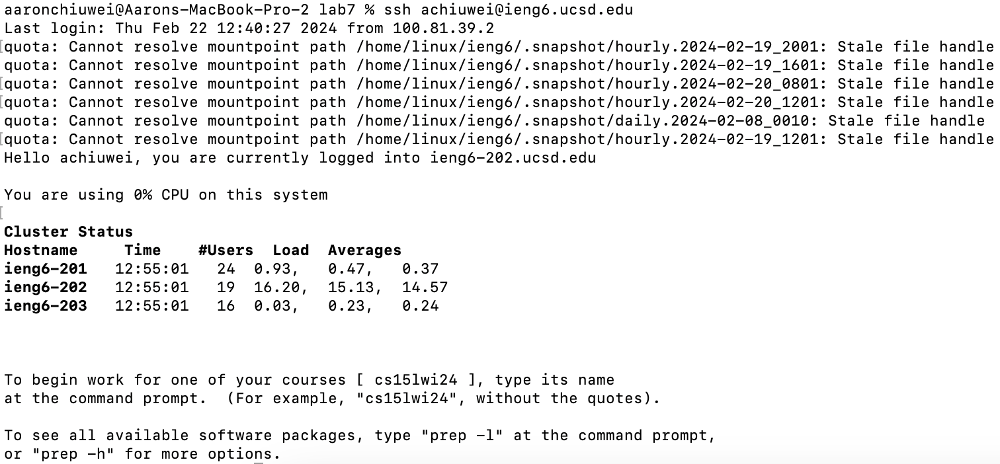
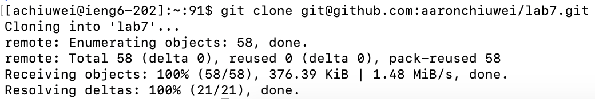
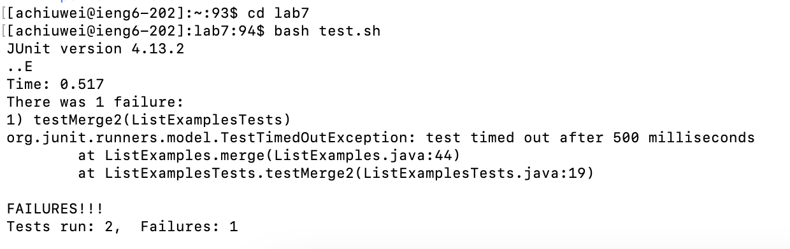
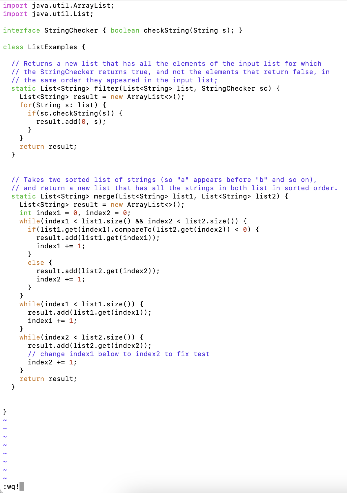
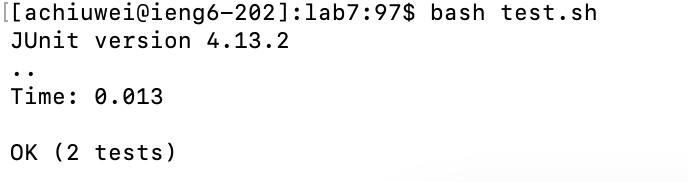
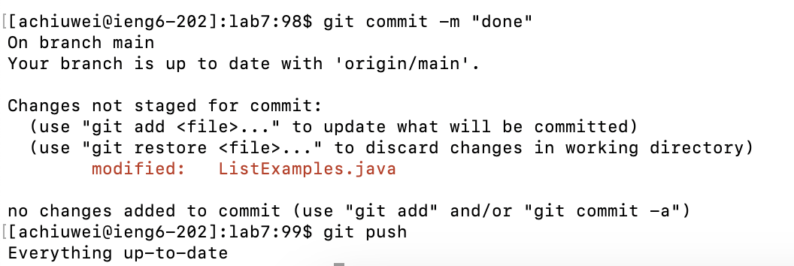

# Lab Report 4 - Vim (Week 7)
**Step 4**
  
  Keys Pressed: `<up><enter>`
 Explanation: The `ssh achiuwei@ieng6.ucsd.edu` command was 1 up in the search history, so I used up arrow to access it.
 **Step 5**
  
  Keys Pressed: `git clone <command-p><enter>`
 Explanation: The `git@github.com:aaronchiuwei/lab7.git` command was already copied, so I first typed out git clone and then pasted the ssh url using `<command-p>`.
 **Step 6**
  
  Keys Pressed: `cd lab7<enter>bash test.sh`
 Explanation: I first pathed to the lab7 directory then ran the test.sh script.
 **Step 7**
  
  
  Keys Pressed: `vim ListExamples.java<enter> hhxi2<esc>:wq<shift-1><enter>`
 Explanation: I first ran vim on ListExamples.java then moved the cursor over the `1` in `index1`, deleted it, and replaced it with `2` to fix the file. I then saved and quit the vim by typing `:wq!`.
 **Step 8**
  
  Keys Pressed: `<up><up><enter>`
 Explanation: The `bash test.sh` command was 2 up in the search history, so I used up twice arrow to access it.
 **Step 9**
  
  Keys Pressed: `git commit -m "done"<enter>git push`
 Explanation: I first committed the changes with a message of `done` and then pushed the changes to GitHub.
