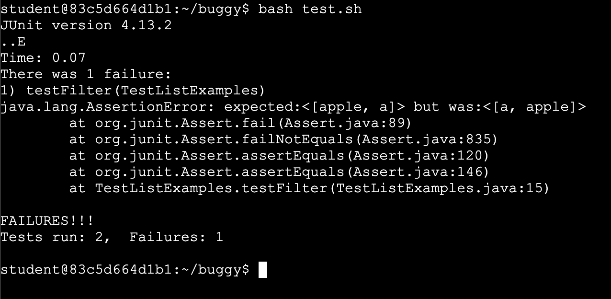
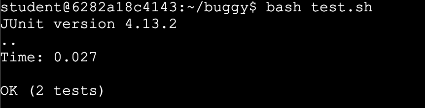
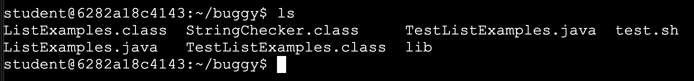

# Lab Report 5 - Putting it All Together (Week 9)
## Part 1 – Debugging Scenario**
**1. Student Post**
<br> I am a struggling student and I am running a bash script to test the ListExamples.java on and I am looking for where in the filter method the test failed. It says that the expected array is different from the actual array. However, I cannot find where in the filter method to change. I included the output of the bash script, ListExamples.java, and TestListExamples.java.
<br> 

<br>**2. TA Response**
<br>From the provided code, the problem is where each string is being added to the result list. Instead of `result.add(0, s)`, it should be replaced with `replace.add(s)`. This is because the original line of code added the string to the start of the list rather the end.

<br>**3. Student Response**
<br>Thank you that worked and I was able to pass the tests. The bug was exactly what you described.
<br> 

<br>**4. Setup**
<br>The file & directory structure needed:
<br> 
<br>Contents of `ListExamples.java` before fixing the bug:
```java
import java.util.ArrayList;
import java.util.List;

interface StringChecker { boolean checkString(String s); }

class ListExamples {
  static List<String> filter(List<String> list, StringChecker sc) {
    List<String> result = new ArrayList<>();
    for(String s: list) {
      if(sc.checkString(s)) {
        result.add(0, s);
      }
    }
    return result;
  }

  static List<String> merge(List<String> list1, List<String> list2) {
    List<String> result = new ArrayList<>();
    int index1 = 0, index2 = 0;
    while(index1 < list1.size() && index2 < list2.size()) {
      if(list1.get(index1).compareTo(list2.get(index2)) < 0) {
        result.add(list1.get(index1));
        index1 += 1;
      }
      else {
        result.add(list2.get(index2));
        index2 += 1;
      }
    }
    while(index1 < list1.size()) {
      result.add(list1.get(index1));
      index1 += 1;
    }
    while(index2 < list2.size()) {
```
<br>Contents of `TestListExamples.java` before fixing the bug:
```java
import java.util.ArrayList;
import java.util.List;
import java.util.Arrays;
import static org.junit.Assert.*;
import org.junit.*;

public class TestListExamples {
  @Test
  public void testFilter() {
    List<String> strs = new ArrayList<>();
    strs.add("a");
    strs.add("b");
    strs.add("apple");
    List<String> filtered = ListExamples.filter(strs, s -> s.charAt(0) == 'a');
    assertEquals(filtered, Arrays.asList("a", "apple"));
  }

  @Test(timeout=100)
  public void testMerge() {
    List<String> strs1 = new ArrayList<>();
    List<String> strs2 = new ArrayList<>();
    strs1.add("a"); strs1.add("b"); strs1.add("cranberry");
    strs2.add("dragon");
    List<String> merged = ListExamples.merge(strs1, strs2);
    assertEquals(merged, Arrays.asList("a", "b", "cranberry", "dragon"));
  }
}
```
<br>The full command line (or lines) you ran to trigger the bug: `bash test.sh`
<br>A description of what to edit to fix the bug: To fix the bug, I changed `result.add(0, s)` to `replace.add(s)` in the filter method.
## Part 2 – Reflection
Something that I learned from my lab experience in the second half of this quarter is the usefulness of bash scripts in speeding up programming processes. I learned many different commands that can be included in the bash script and it was cool to learn how a bash script is used to create the autograder as well as being used in many other applications.
